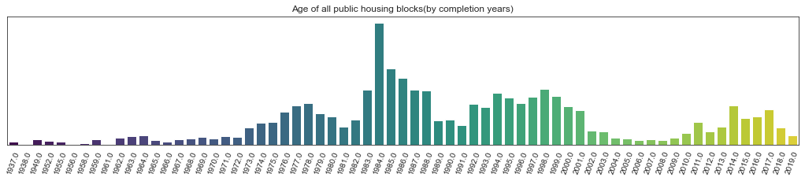
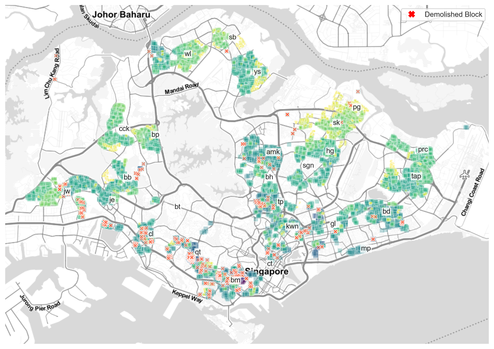
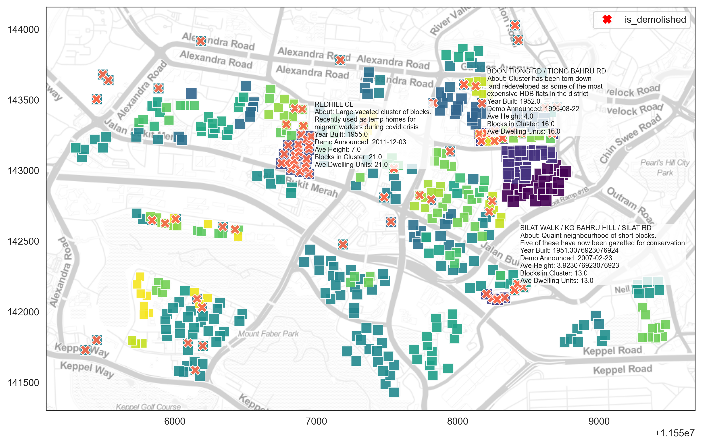
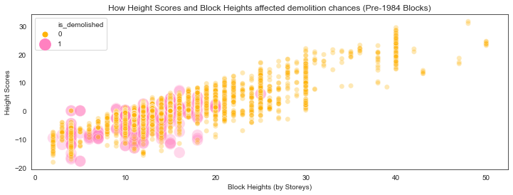
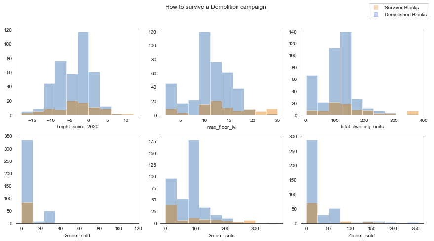
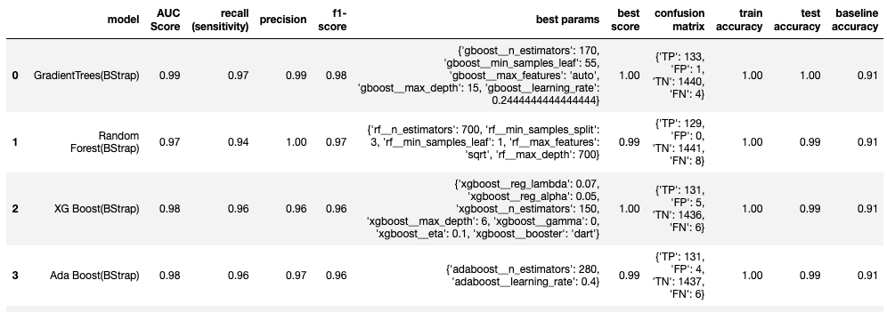

</img> 
<br>

# `DEMOLITION PREMONITION`
#### `Using machine learning classifiers to` 
#### `predict and learn the reasons` 
#### ` behind the demolition of ` 
#### `public housing blocks` 
#### `in Singapore`
# - 
##### `by Samuel He`

---

## Which block falls next ? 
In Singapore, eight in ten citizens own public housing flats that are on a 99-year lease from the government. The young nation has yet to see the lease run out on any of those blocks, but the government has already proactively demolished some 500 blocks as part of the Selective En bloc Redevelopment Scheme (SERS). In land scarce Singapore, the freed up land is used almost exclusively for building taller blocks and more densely-packed estates. 

Residents in a demolished estate are given a new home with a renewed 99-year lease and an additional compensation package! Thus, predicting the odds of a block being demolished has become a source of speculation in investment forums, coffeeshop conversations and the mind of the average Singaporean dreamer. 

Our project aims to use machine learning classifiers to learn the reasons why certain public housing blocks get picked for demolition -- and boldly predict what blocks will be demolished in the near future.

</img> 
</img> 
**Blocks of Ages**
>  We can see that our newest districts are at the northern parts of the island -- in Sengkang, Punggol and Eastern Yishun. No surprises that the demolished blocks all come from older estates. There were also building booms in the 80s and 90s. We can see buildings from that generation(orange squares) dominating our map.  

</img> 
**Bukit Merah**
>  Bukit Merah is Singapore's hotbed of Redevelopment activity. There are 98 blocks that have been part of the SERs scheme in the district. 

</img> 
</img> 

**Looking at block heights objectively** 
>  In the the northern and eastern parts, block heights tend to be shorter. This is likely due to building restrictions for blocks within a certain distance to Singapore's five active airports and airbases(It'll be rare to spot any block higher than 20 storeys high.). This means that some of these buildings, might be short, but is already at its highest height potential and thus, there is low incentive to demolish such buildings to build higher. Thus, we engineered a height score feature that takes into account the heights of the surrounding blocks. We find this feature to be a lot more objective than the height of the block itself, as it takes into account some form of construction height limits in the vicinity. A negative score here means that a particular block can be demolished and built even higher, whereas, a postive score means that the block is towering above its peers or at least at a similar height to its peers. (possibly meaning a new block built in its place might not be able to be built taller). 

</img> 

**Survivor Instincts** 
>  The government does not always raze an entire estate to the ground. Some blocks "survive" the wrecking ball even though they were part of the same estate and built in the same generation. We analyse the characteristics of some of these blocks. The bar plots above show just how there is no clear metric that the government is using to choose survivors(and just how hard it is to do a predictions!). We can identify some outlying characteristics like high Height Scores (above 5), high Maximum Floor Levels (above 20 floors), high Total Dwelling Units (above 300), but these describes only a minority of survivor blocks. 

## Project Processes

#### Data Collection and Cleaning
These were crucial parts of our project. Although the government has released extensive information about existing Housing Development Board(HDB) public housing blocks, there's only scant information about demolished blocks online -- mostly manually-collected datasets and pictures from nostalgia blogs. The HDB's resale price archive was a precious resource for us to obtain accurate information about demolished blocks. We also accessed OneMapSG's API to obtain geographic location data for each of our blocks. 

#### EDA and Feature Engineering
During our EDA process we created geographical plots that helped us understand the challenge at hand. One example saw us plotting the carpark types against the age of blocks. From those plots, we can see that older estates are more likely to use surface carparks instead of multi-storey carparks. 

#### Method
We created two sets of data for our model:
> **Pre-1987 Blocks**: As the youngest block to be demolished so far was in 1986. Our training set will be all the blocks that Singapore has built before 1987. This allows our classifier to ask accurate questions about blocks in that generation. 

> **Post-1986 Blocks**: The blocks in our second dataset will all be standing blocks built after 1986. All these blocks are currently still standing. Our trained model aims predict which blocks will come next.

#### Modelling
</img>

We auditioned different models before deciding on a bootstrapped Gradient Boosting Classifier as our production model. Our top choices were all Classifier Trees(although we were really rooting(no pun intended) for a Logistic Regression model as its results would be more interpretable). 
Although Random Forests had a perfect precision score, the Gradient Boosting Classifier's scores are higher across multiple metrics. 
Despite its performance on the training set, our model did not generalise well in with the data in our unseen test set. More on that in our evaluation below. 


## Directory
The project is organised into five notebooks:

```
DEMOLITION PREMONITION:
|__ code
|   |__ 01_HDB_Data_Collection.ipynb   
|   |__ 02_Scraping_OneMapSG.ipynb   
|   |__ 03_Data_Cleaning_EDA_Part_1.ipynb
|   |__ 04_Data_Cleaning_EDA_Part_2.ipynb
|   |__ 05_Modelling.ipynb 
|__ data
|   |__ hdb_standing.csv
|   |__ hdb_demo_extensive_21APRIL.csv
|   |__ hdb-carpark-information.csv
|   |__ resale-1990-1999.csv
|__ assets
|   |__ (various_images_used_for_presentation)
|__ slides.pptx
|__ README.md
```


## List of Datasets Used
| Dataset                                          	| Description                                                                                                                                                                                                                                                                              	| Source                                                                                                  	| Filenames                      	|
|--------------------------------------------------	|------------------------------------------------------------------------------------------------------------------------------------------------------------------------------------------------------------------------------------------------------------------------------------------	|---------------------------------------------------------------------------------------------------------	|--------------------------------	|
| <br>Singapore's Existing Public Housing Blocks   	| Addresses of existing HDB blocks, highest floor level, year of completion, type of building and number of HDB flats (breakdown by flat type) per block. Also includes other administrative and retail buildings like HDB's HQ and hawker centres.                                        	| Housing Development Board (via [Data.gov.sg](https://data.gov.sg/dataset/hdb-property-information))     	| hdb_standing.csv               	|
| <br>Singapore's Demolished Public Housing Blocks 	| Information about demolished HDB blocks manually collected by researcher Teo Alida. HDB does not actively release information about its demolished blocks.  As Teo's data was incomplete, we had to manually impute missing details via additional research and inferential imputation.  	| Adapted from the work of [Teo Alida](https://www.teoalida.com/singapore/serslist/#potential-sers-sites) 	| hdb_demo_extensive_21APRIL.csv 	|
| <br>HDB Carparks                                 	| Details about existing HDB Carparks including carpark types, number of decks, details about parking pricing.                                                                                                                                                                             	| Housing Development Board (via [Data.gov.sg](https://data.gov.sg/dataset/hdb-carpark-information))      	| hdb-carpark-information.csv    	|
| <br>HDB Resale Prices                            	| Resale Flat transactions from the 1990s. This was useful in helping us seek missing information in our demolished blocks like "Year Completed" and "Block Height".                                                                                                                       	| Housing Development Board (via [Data.gov.sg](https://data.gov.sg/dataset/resale-flat-prices))           	| resale-1990-1999.csv           	|
| <br>MRT Station Coordinates                      	| Latitude and Longitude location information for the LRT and MRT stations in Singapore.                                                                                                                                                                                                   	| [Hui Xiang Chua](https://data.world/hxchua/train-stations-in-singapore)                                 	| mrt_coords.csv                 	|


## Project Evaluation and Future Development.

> **Unique Dataset** - Through data cleaning and scraping and inference from multiple datasets, we've assembled a unique dataset with details of 391 demolished blocks(with some margin of error). This can benefit future research into demolished blocks in Singapore.

> **Improving Data Collection Accuracy** - We can definitely improve the accuracy of some of the details in the the dataset. In our cleaning and imputation processes, we've used too much inference and ended up cleaning specks of "dirty data" along the way.  One possible source of accurate information we can use is the property website EdgeProp, which seems to have quite a lot of details of demolished blocks stored in their archive(complete with photos for verification). Access to their API might definitely benefit the accuracy of the dataset. 

> **Near-Perfect Performance on Bootstrapped Gradient Boosting Classifier** - On the training and test set, our model has scored well on multiple metrics, with an impressive AUC-ROC score of 0.99. The model performed well even without being fed revealing features like Latitude-Longitude and Block Heights.

> **Why did the government choose these blocks?** - We set out to find out the reasons behind the picking of the 391 blocks for demolition. Our model revealed that the age of the block, it's distance to nearby airfields and the number of three-room flats sold are important factors in deciding whether a block should go or not. The eighth-most important factor is the estimated land use for the block, a feature that we engineered. In future iterations of the project, we can try to build off this information and get more data related to these important features.

> **Odd and Wild Performance on Unseen Data** - The model isn't exactly generalising well at the moment. In 2045, it predicted that some 1225 blocks will be demolished. And in the year 2110, it predicted that no blocks will get demolished, even though many of the leases on our flats would have expired by then!

> **Ways to Generalise better** - One of the challenges with our data is that the types of flats and blocks change from generation to generation. So there might be a problem with our method of using a model trained on the blocks from the 1930s-1980s, and applying it to blocks from 1980s-present.  For example, a *3-Room Standard (1960-1970)* is about 50-55 sqm in size but a *3-Room Model A* (2002-present) measures about 60-65 sqm. Although there is a difference of about about 10 sqm, this appears in our dataset as the same feature. Maybe a time-series model might work much better for an unseen data set that is from the future. 


## References

*“Don't Assume All Old HDB Flats Will Become Eligible for Sers, Cautions Lawrence Wong.”* The Straits Times, The Straits Times, 24 Mar. 2017, www.straitstimes.com/singapore/housing/dont-assume-all-old-hdb-flats-will-become-eligible-for-sers-cautions-lawrence-wong.

*“List of SERS sites.”* Teoalida.com, 14 May 2017, https://www.teoalida.com/singapore/serslist/#potential-sers-sites.

*“Kampong Silat Estate.”* State of Buildings, stateofbuildings.sg/places/kampong-silat-estate.

*SERS - Housing & Development Board (HDB)*, www.hdb.gov.sg/cs/infoweb/residential/living-in-an-hdb-flat/sers-and-upgrading-programmes/overview-of-sers&rendermode=preview.
